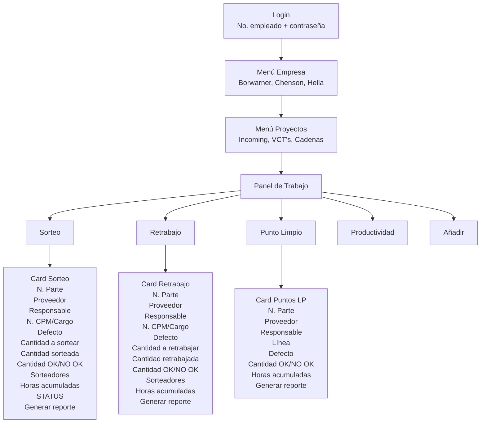

# Diagrama-de-flujo

```mermaid
flowchart TD
    A[Login\nNo. empleado + contraseña] --> B[Menú Empresa\nBorwarner, Chenson, Hella]
    B --> C[Menú Proyectos\nIncoming, VCT's, Cadenas]
    C --> D[Panel de Trabajo]
    D --> E[Sorteo]
    E --> F[Card Sorteo\nN. Parte\nProveedor\nResponsable\nN. CPM/Cargo\nDefecto\nCantidad a sortear\nCantidad sorteada\nCantidad OK/NO OK\nSorteadores\nHoras acumuladas\nSTATUS\nGenerar reporte]
    D --> G[Retrabajo]
    G --> H[Card Retrabajo\nN. Parte\nProveedor\nResponsable\nN. CPM/Cargo\nDefecto\nCantidad a retrabajar\nCantidad retrabajada\nCantidad OK/NO OK\nSorteadores\nHoras acumuladas\nGenerar reporte]
    D --> I[Punto Limpio]
    I --> J[Card Puntos LP\nN. Parte\nProveedor\nResponsable\nLínea\nDefecto\nCantidad OK/NO OK\nHoras acumuladas\nGenerar reporte]
    D --> K[Productividad]
    D --> L[Añadir]
```
